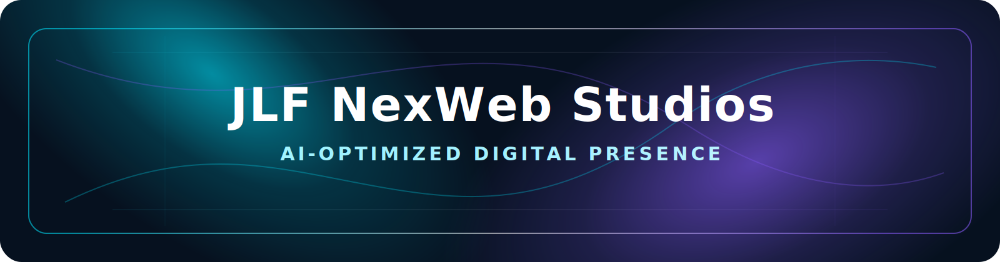

  

  
  
  

<h1 align="center">Hi, I'm Janko Ferreira</h1>

<h3 align="center">AI-Optimized Web Developer | Data & Systems | Automation Builder</h3>

  I build fast, modern, AI-readable websites and workflow tools that help businesses get found,
  understood, and recommended by AI tools.

---

## NexWeb AI Studios

**NexWeb AI Studios** creates premium digital presence systems for businesses that need more than a basic website. My work blends sharp front-end design, structured content, automation, and AI-ready foundations so brands are easier for people and intelligent tools to understand.

- Fast, responsive websites with clean visual hierarchy
- AI-readable structure, metadata, content clarity, and technical SEO thinking
- Workflow tools, dashboards, and automations that reduce manual admin
- Practical builds for small businesses, service providers, and growing teams

---

## Tech Stack

  
  
  
  
  
  
  
  
  
  
  
  

---

## Featured Projects

| Project | Focus | Links |
| --- | --- | --- |
| **JLFdev.co.za** | Personal portfolio and NexWeb AI Studios presence | [Live Site](https://jlfdev.co.za/) · [Repository](https://github.com/JankoFerreira/jlfdev-portfolio) |
| **LYP SA / lypsa.co.za** | Business website with modern responsive structure | [Live Site](https://lypsa.co.za/) · [Repository](https://github.com/JankoFerreira/lypsa-web) |
| **Bernina Moot Demo** | Premium demo website for a local retail/service brand | [Live Demo](https://jankoferreira.github.io/Berninamoot-demo-website/) · [Repository](https://github.com/JankoFerreira/Berninamoot-demo-website) |
| **CSM Website** | Business website build focused on clarity and conversion | [Live Demo](https://jankoferreira.github.io/CSM--Website/) · [Repository](https://github.com/JankoFerreira/CSM--Website) |
| **ComputerHaven Demo** | Technology retail/service demo website | [Live Demo](https://jankoferreira.github.io/ComputerHaven-demo-website/) · [Repository](https://github.com/JankoFerreira/ComputerHaven-demo-website) |
| **VELA Beauty Studio Demo** | Beauty studio demo with polished visual direction | [Live Demo](https://jankoferreira.github.io/vela-website/) · [Repository](https://github.com/JankoFerreira/vela-website) |

---

## Current Focus

- **React / Three.js** for richer, more interactive web experiences
- **AI-optimized websites** that are fast, structured, and easy to interpret
- **FastAPI apps** for practical business tools and data-driven workflows
- **Workflow automation** with Python, VBA, AppSheet, and connected systems

---

## GitHub Snapshot

  
  

  

  

---

## Let's Connect

  
  
  
  

---

  <strong>NexWeb AI Studios</strong> 
  AI-Optimized Digital Presence

